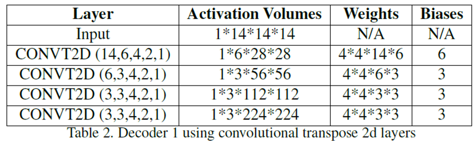
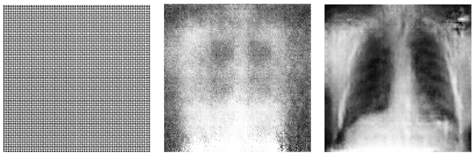

# Generating Synthetic Chest X-Rays with generative modeling
This custom final project is part of the CS231N Graduate Course in Deep Learning in Computer Vision, Post-Graduate Certificate in AI from Stanford University. 

**-- Project Status Completed**
*Readme.md update: 2025-08-27*

To run this project on your local machine:

1. Clone the repository:
   ```bash
   git clone https://github.com/juanpajedrez/CS231N-Final-Proj.git```
2. Run with Jupyter: https://jupyter.org/install 


### Contributors
- Abhishek Kumar
- Juan Pablo Triana Martinez

## Model Architectures
Before mentioning the project's intro objective, the following images showcase a visual representation of what this repository is all about.


## Project Intro/Objective
The primary objective of this project is to evaluate and compare the performance of generative AI models for chest X-ray (CXR) image synthesis, specifically focusing on GANs and various VAE architectures. The study is conducted using the NIH ChestX-ray14 dataset (CXR8), which contains images annotated with 14 different thoracic disease conditions.

#### VAE Objectives

Our goal is to explore different variants of Variational Autoencoders (VAEs) to generate high-fidelity CXR images. The following approaches were considered:
- **Baseline VAE:** Train a standard VAE to reconstruct and generate realistic CXR images.
- **Gaussian Mixture VAE (GMVAE):** Extend the latent space to a Gaussian mixture distribution, allowing for richer representation and potentially more diverse generated images.
- **Fully Supervised GMVAE (FS-GMVAE):** Incorporates a binary 14-dimensional label vector to sample images corresponding to specific disease categories.

To improve performance and analyze architectural variations, the following design elements were integrated across the different VAE implementations:

- **Feature Extraction with Pretrained Networks:** VGG16 and DenseNet121 were used as frozen feature extractors to provide high-level representations of CXRs.
- **Transition Layer Experimentation:** A transition layer was introduced between the encoder’s compressed space and the latent sampling layer to test the effect of additional neurons on generative quality.
- **Label Conditioning (FS-GMVAE):** Inclusion of binarized positional labels to enable class-specific generative sampling.
- **Convolutional Decoder:** Replaced traditional linear decoders with transposed 2D convolutional architectures for more realistic image generation.

The following images display the two different types of decoders used in this repository, labeled as decoder 1 and decoder 2.



The figure below illustrates the architectural design of the VAEs, and the variations tested.


#### GAN Objective

In parallel, a Least Square GAN architecture was developed to generate synthetic CXR images from a standard latent z-space. The objective is to directly compare the image fidelity, diversity, and condition-specific sampling capabilities of GANs against VAEs and their extensions.

## Technologies
- Python
- Jupyter Notebook

## Dataset
- **Source**: https://nihcc.app.box.com/v/ChestXray-NIHCC/file/220660789610
- **Variables**: Aside from the multi-discrete label from the following 14 different conditions: (Atelactasis, Cardiomelagy, Effusion, Infiltration, Mass , Nodule, Pneumonia, Pneumothorax, Consolidation, Edema, Emphysema, Fibrosis, Pleural Thickening, Hernia).
- **Size**: The dataset comprises 112,120 X-ray frontal view images from 30,850 unique patients. Each of these images has a resolution of 1024 x 1024. They are labeled with 14 different labels representing the binary label presence of one of the 15 different classes, 14 representing the chest X-rays conditions, and one referring to no findings.
- **No Findings**: Interestingly, there is a much higher number of downloadable images than 112,120 Chest X-ray images, where they contain No findings as the label. These are important to add to give the model the ability to determine when a frontal chest X-ray doesn’t contain any medical conditions.


## Project Description
1. **Data Acquisition**:
- The dataset was downloaded directly from the NIH website using a custom script (utils/fig_downloader.py).
2. **•	Preprocessing Chest X-rays**:
- Images were resized to 256 × 256, followed by a center crop to 224 × 224.
- Normalization was applied across the three channels to standardize pixel values.
3. **GMVAE & FS-GMVAE Experiments**:
-	Model implementations and training scripts are located in the utils/ folder.
-	Training can be executed via:
  - run_fs_gmvae.py (Fully Supervised GMVAE)
  - run_gmvae.py (GMVAE)
4. **VAE & GAN Experiments**:
-	VAE and GAN implementations are in the train/ folder.
-	Training can be executed via:
  - vae.py (VAE)
  - model.py (GAN)

One limitation of this project was the lack of image balancing. A key point that wasn’t addressed is that the images may contain multiple conditions simultaneously (co-occurrence). This makes the problem more complex, since applying effective data augmentation on co-occurring conditions requires advanced techniques and a high level of expertise.

## GMVAE and FS-GMVAE Results:


**Recommendations**
These are the main recommendations we identified for future analyses on multiclass generative Chest X-ray data using GMVAEs and FS-GMVAEs:
  1. **Addressing class imbalance**
  The dataset was not balanced before fine-tuning, which can lead to severe model bias in interpreting the data. While real-world distributions may indeed reflect a higher prevalence of certain conditions (e.g., cardiomegaly vs. effusion), exploring strategies to balance precision and generalization remains a critical area for future research.
  2. **VAEs Gen Images are blurry**
  Across all different GMVAEs and FS-GMVAEs, the generative images are blurry. This suggests that images coming from a K-Gaussian linear z-space representation, even with a higher number of K and z-space vectors, it appears the spatial reconstruction become blurry. Things to consider for future analysis are to rerun the same versions, but with a smaller number of Chest-X-rays diseases, for instance, 3 diseases. Another is to find a sampling methodology that uses a convolutional kernel to keep spatial features from Chest X-ray images.
  3. **FS-GMVAE with Convolutional 2D Layer-Decoder**
  From images created of FS-GMVAE V1 to V3, it’s obvious that the best generative images use decoders with convolutional 2D-Transpose layers. 
  4. **Varying Z-space and K-gaussians doesn’t truly improve image quality**
  From all the different versions of GMVAEs V4 to V8, the generated images are still of low quality. The idea that increasing the z-space length and increasing the k-gaussian would result in a more powerful model (it does), but it’s not enough to capture the spatial relationships between the chest X-ray structures.
  5. **Transitional Layers don’t truly improve image quality**
  Using a transitional layer of linear layers after compressing the space from pre-trained convolutional models doesn’t improve image quality.
  6. **Progressive complexity with conditions**
  This project began directly with all 14 chest X-ray conditions. A valuable direction would be to examine how generative models perform as the number of conditions increases incrementally. For example, starting with only 2 conditions, then expanding to 4, 6, 8, and so forth, would provide insights into scalability and model robustness.
  7. **Encoder was not set to train witg VAE architectures**
  Due to the magnitude of the encoders (VGG16 or DenseNet121), these encoders weight parameters were frozen during VAE training. Next time, it's imperative to either have higher computational resources to fine-tune the encoder layers during VAE training, or create a smaller, yet more powerful encoder (small computer-vision transformer model).

## VAE and GAN Results:



**Recommendations**
These are the main recommendations we identified for future analyses on multiclass generative Chest X-ray data using VAEs and GANs.
1. **VAE images are blurry**
Compared to GMVAEs and FS-GMVAEs that use a z-space represented with a multi-K-Gaussian. VAEs with a simple z-space Gaussian still create blurry images.
2. **Least Squares GANs created actual visible Structures**
Although the images are not fully usable, the blurriness, which was present when using a least squares GAN, has completely disappeared. Additionally, it’s visible to see actual Chest X-rays images! Additionally, the training and testing of this AI are significantly smaller than those of higher-dimensional VAEs and GMVAEs.

## Conclusion

Overall, least squares GANs (LSGANs) produced the most visually convincing Chest X-ray generations in our experiments—sharp edges, recognizable anatomical structures, and reduced blurriness—while requiring less training time than higher-dimensional VAEs/GMVAEs. In contrast, VAEs, GMVAEs, and FS-GMVAEs consistently yielded blurry reconstructions, and simply increasing latent dimensionality or the number of K-Gaussians did not recover fine spatial detail. FS-GMVAE variants with 2D transposed-convolution decoders helped, but not enough to close the gap.

That said, VAEs remain attractive for their stability and likelihood-based training. Two promising paths to narrow the quality gap are:
1.	**Convolutional sampling procedures** that preserve local structure during latent sampling/decoding (e.g., kernel-aware sampling or spatially correlated noise), and
2.	An **upgrade to latent diffusion models**, which have demonstrated strong fidelity–diversity trade-offs and superior spatial detail while operating in a compact latent space.

In short: LSGANs are the stronger baseline today for perceptual quality on multiclass Chest X-rays, but VAEs/GMVAEs can still improve with structure-preserving sampling and, ultimately, latent diffusion—especially if paired with better class balancing and a staged increase in condition count.

Thank you for your time and visiting this project!
